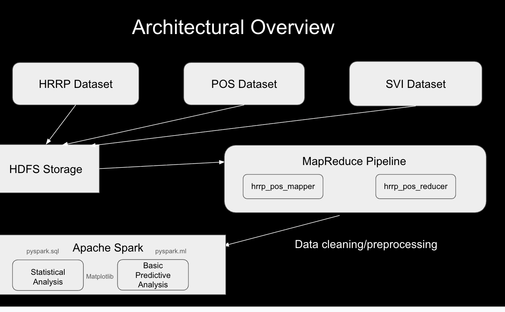
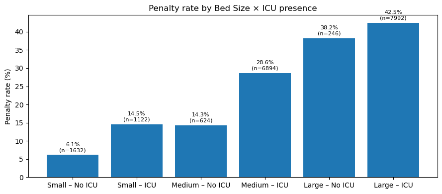
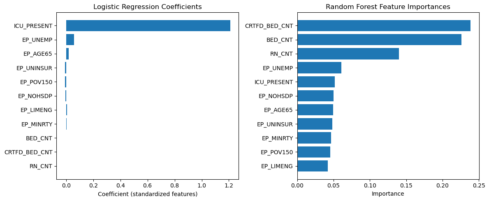

# Modeling Hospital Readmission Penalties Using Social Vulnerability Indicators (SVI)

**Prepared by:** Taaha Bin Mohsin\
**Artifacts:** Hadoop MapReduce ETL (to build `hrrp_cleaned.csv`) + Jupyter notebook for analysis & modeling with Apache Spark

---

## Summary

**The product**
A reproducible pipeline that links Medicare’s HRRP penalties with county-level Social Vulnerability Index (SVI) and facility operations (beds, ICU, RN staffing) to explain - and modestly predict - which medical facilities rows are penalized.

**Initial hypothesis** SVI (Social Vulnerability Indicators) are primarily predictive of the likelihood of a facility being penalized by the HRRP.

**Result of data analysis** Operational scale/complexity — bed counts, RN (registered nurse) staffing, and ICU presence — are more strongly predictive of penalization odds. SVI contributes, but with smaller and more mixed effects. The model is best used to rank facilities for review rather than to make automatic decisions.

**Analytical Insight** Penalties can create a vicious cycle for high-complexity providers. This analysis supports peer grouping by complexity, fairness monitoring, and targeted improvement assistance.

---

## Context & Objective

Medicare’s HRRP reduces payments to hospitals with higher-than-expected readmissions (ERR > 1.0). The goal is to understand drivers, fairness risks, and whether a screening model can help prioritize quality-improvement outreach while avoiding over-penalization of larger hospitals that handle complex cases.

**Objective.** Deliver a clear narrative and decision support: what drives penalties, how reliable a simple model is, and how to operationalize it responsibly.

---

## Data & Pipeline

* **Sources.** HRRP (ERR & penalties), POS (facility operations) datasets from CMS (Centers for Medicare & Medicaid Services), and the SVI (county vulnerability) dataset from the CDC (Centers for Disease Control and Prevention).
* **ETL (Hadoop MapReduce).**  Data pre-processing (joining the HRRP dataset with the massive POS dataset), cleaning and feature fallbacks (e.g., beds, RN, ICU) materialized to **`hrrp_cleaned.csv`** in HDFS.
* **Analysis & ML (Spark).** Consumes the single artifact for descriptive analysis and modeling.

> **Figure 1.** Pipeline schematic: HDFS → MapReduce → `hrrp_cleaned.csv` → Spark (analytics & models).

---

## Feature Definitions/Data Hygiene

* **BEDS\_FEAT:** Use `BED_CNT` and if that's missing, we use `CRTFD_BED_CNT`.
* **RN\_num:** Use `RN_CNT`, and if that's missing, we use `RN_FLTM_CNT`.
* **ICU\_PRESENT:** `1` if `ICU > 0` or `ICU_SRVC_CD ≥ 1`; else `0`.
* **SVI (county):** `EP_UNEMP`, `EP_NOHSDP`, `EP_LIMENG`, `EP_MINRTY`, `EP_UNINSUR`, `EP_POV150`, `EP_AGE65`.
* **Label:** `Penalized = 1` if `ERR>1.0` (note: `ERR` obviously cannot a feature).

---

## Key Analytical Insights

### State variation

Highest % penalized (top 5):
MA 49.39%, NJ 48.91%, FL 46.61%, DC 44.44%, IL 41.67%.

Lowest % penalized (bottom 5):
ID 7.29%, SD 8.33%, WY 10.61%, UT 13.54%, MT 15.15%.

There's no clear geographic pattern dictating the likelihood of a facility being penalized. State‑level aggregation masks community effects; if SVI matters, it likely doesso at hospital/county granularity.

### ERR and SVI (county social vulnerability)
Pearson/Linear correlation with ERR:

EP_UNEMP +0.1233, EP_MINRTY +0.1001, EP_LIMENG +0.0761, EP_POV150 +0.0548, EP_UNINSUR +0.0188, EP_AGE65 -0.0034.

Socioeconomic vulnerability shows small positive relationships with ERR; age 65% is roughly neutral. These are not strong drivers compared with operational factors.

### Hospital size (bed count) & penalties

Penalty rate by bed-size:

<50: 8.83% (n=2,490)

50–99: 19.60% (n=3,030)

100–199: 31.35% (n=4,494)

200–299: 40.34% (n=2,898)

300+: 43.27% (n=5,598)

Takeaway: penalties rise sharply with hospital size, with bed count being a proxy for the former. Scale and complexity seem to drive the odds of being penalized up.

### Staffing (RN) & penalties

Penalty rate by RN staffing quartiles:

Low: 15.95% (n=4,620)

Medium-Low: 28.22% (n=4,614)

Medium-High: 38.23% (n=4,632)

High: 43.15% (n=4,644)

(Bands: 1-46, 47-90, 91-180, 181+ RNs)

Takeaway: higher staffing bands correlate with higher penalties - consistent with larger hospitals equipped to take on more complex caseloads.

### ICU presence (complexity) & penalties

ICU present: 34.55% penalized (n=16,008)

No ICU: 11.31% penalized (n=2,502)

Takeaway: There's a ~3X higher chance a facility with an ICU gets penalized. Complexity is a major context for penalties.

### Size × ICU interaction (qualitative)

Bed size and ICU presence interact in tandem with penalization rates: large hospitals have high rates regardless, ICU still adds ~4%; smaller/medium hospitals see bigger jumps when ICU is present.

---

## Predictive Models (test set, threshold 0.50)

**Logistic Regression**

* **AUC:** 0.6452
* **Accuracy:** 0.6747
* **Precision** 0.4502
* **Recall** 0.0551

**Random Forest**

* **AUC:** 0.6830
* **Accuracy:** 0.6806
* **Precision:** 0.5714
* **Recall:** 0.0614

**Operating point (0.50).** Conservative by design: limits false alarms but misses many true positives. We could potentially lower internal thresholds only for outreach, not penalties, as the latter could have negative implications for the facility.

---

## What Drives Predicted Penalties?

**Random Forest - Feature Importances**
Top signals: `CRTFD_BED_CNT` 0.2385, `BED_CNT` 0.2262, `RN_CNT` 0.1400, `ICU_PRESENT` 0.0515. SVI features contribute smaller but consistent signal (e.g., `EP_UNEMP` 0.0610, `EP_NOHSDP` 0.0500, `EP_AGE65` 0.0497).

**Logistic Regression - Coefficients (signed)**
Positive: `ICU_PRESENT` +1.2108, `BED_CNT` +0.0010, `CRTFD_BED_CNT` +0.0003, `EP_UNEMP` +0.0589, `EP_AGE65` +0.0188, `EP_LIMENG` +0.0057, `EP_MINRTY` +0.0037.
Negative: `RN_CNT` −0.0001, `EP_NOHSDP` −0.0067, `EP_UNINSUR` −0.0102, `EP_POV150` −0.0089*.

**Interpretation.** Both models tell the same story: scale and complexity are the main determinants. SVI is secondary and mixed. One has to use peer comparisons to avoid confusing complexity with quality.

---

## Decision Guidance & Recommendations

It's most prudent to treat predictions as a ranking to prioritize reviews, care‑transition checks, and technical assistance - not as automatic penalty triggers.

* Best for use as a ranking tool: prioritize higher-risk hospitals for review, not an absolute yes/no
* Adjust thresholds or weighting if flags cluster unfairly in certain groups.
* Compare across ICU presence and bed-size bands to ensure fairness and avoid over-penalizing hospitals that handle complex cases

---

## Risks & Limitations (and how to mitigate)

* **Class imbalance & 0.50 threshold:** Accuracy looks fine, recall is low; mitigate by using the model for triage and tracking precision/recall at chosen thresholds.
* **Granularity mismatch (SVI county vs. facility outcomes):** Add finer‑level community data where available.
